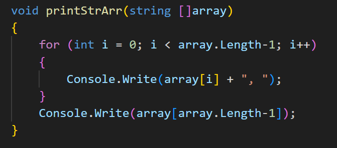
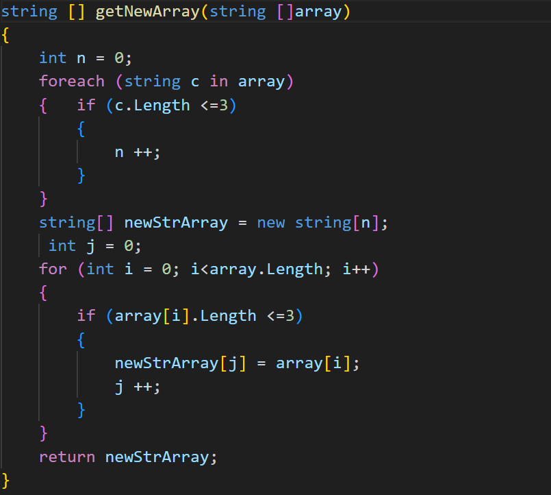
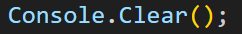
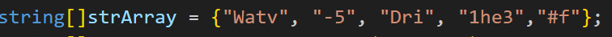
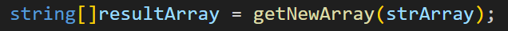
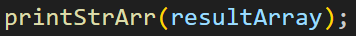

# ИТОГОВАЯ КОНТРОЛЬНАЯ РАБОТА ПО ОСНОВНОМУ БЛОКУ
# Зиновьев Константин

## Описание програмного кода:
* Создаем функцию printStrArr, которая в качестве аргумента принимает на вход массив строк и выводит его на печать. Тип void (ничего не возвращает). При помощи цикла FOR проходим по всем элементам массива с первого до предпоследнего и выводим их на печать добавляя запятую и пробел, затем выводим последний элемент.
 

 * Создаем функцию getNewArray, которая в качестве аргумента принимает на вход исходный массив строк и возвращает новый массив строк, длинна которых не более трех символов.
 Для этого сначала считаем количество строк в исходном массиве, длинна которых не более трех символов:при помощи цикла FOREACH (т.к. мы не меняем массив) проходим по каждому элементу(строке) и если его длинна не более трех, увеличиваем счетчик на 1.
 Далее создаем новый мвссив newStrArray, размер которого равен количеству строк в исходном массиве, длинна которых не более трех символов.
 При помощи цикла FOR проходим по каждому элементу исходного массива и если его длинна не более трех символов, записываем этот элемент в новый массив.
 

* Далее непосредственно сама программа:
    1. Чиcтим консоль

    

    2. Создаем исходный массив строк

    

    3. Вызываем функцию getNewArray для исходного массива и записываем результат в новый массив resultArray

    

    4. При помощи функции printStrArr выводим результат.
    
    

